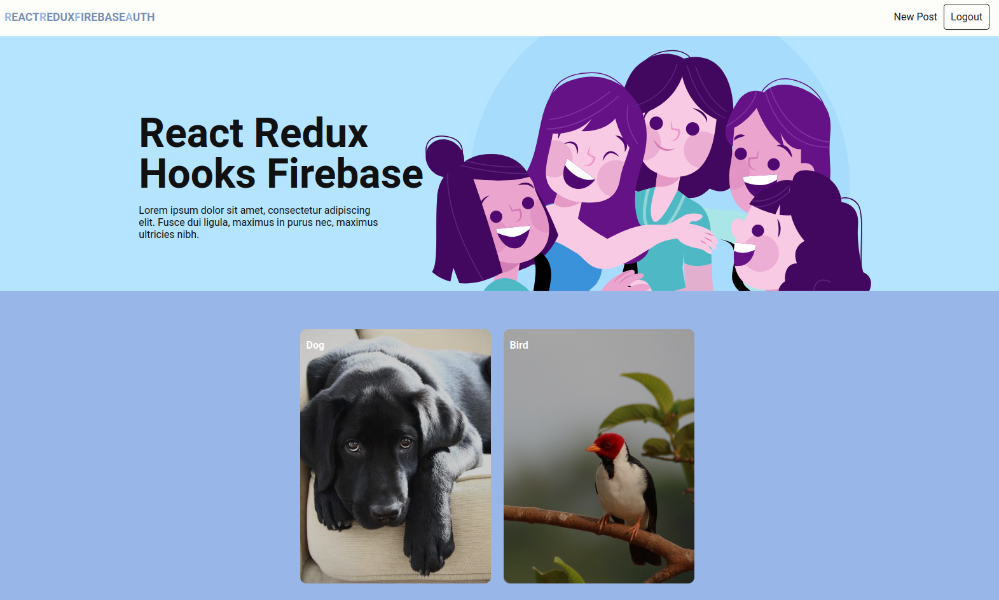
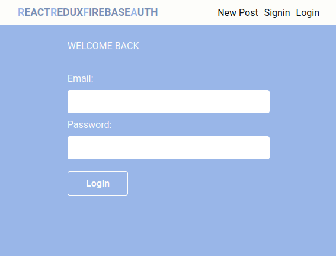
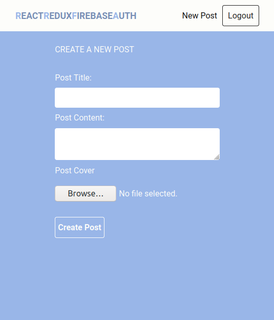
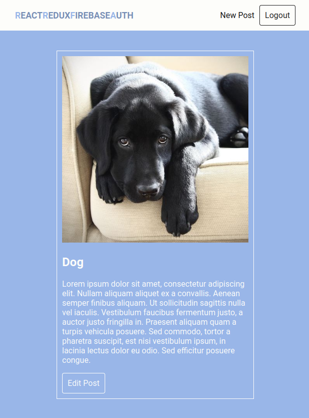

# Blog

## 💻 Projeto

Projeto desenvolvido com base nos vídeos [React/ Redux Hooks With Firebase (Firestore / Auth)][playlist], oferecido por [Aldo Caamal][channel].

## 🛠 Tecnologias

As seguintes tecnologias foram utilizadas no desenvolvimento do projeto:

- [React][react]
- [React Redux][react-redux]
- [Firebase][firebase]

## 📷 Screenshots

<kbd>
  
</kbd>

<kbd>
  
</kbd>

<kbd>
  
</kbd>

<kbd>
  
</kbd>

[playlist]: https://www.youtube.com/playlist?list=PLolX_BtuGc9RI9RDmsy-eAaiyRq2aM6HS
[channel]: https://www.youtube.com/channel/UCsbBhGOM5l927nz5-jTIqlw
[react]: https://reactjs.org/
[react-redux]: https://react-redux.js.org/
[firebase]: https://firebase.google.com/
